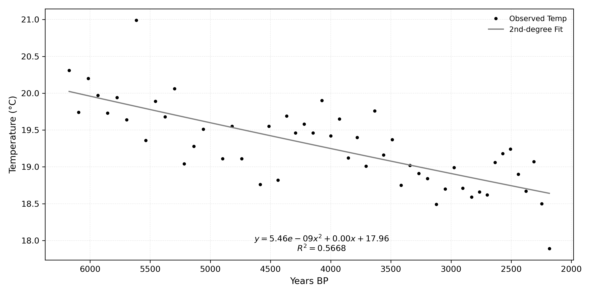
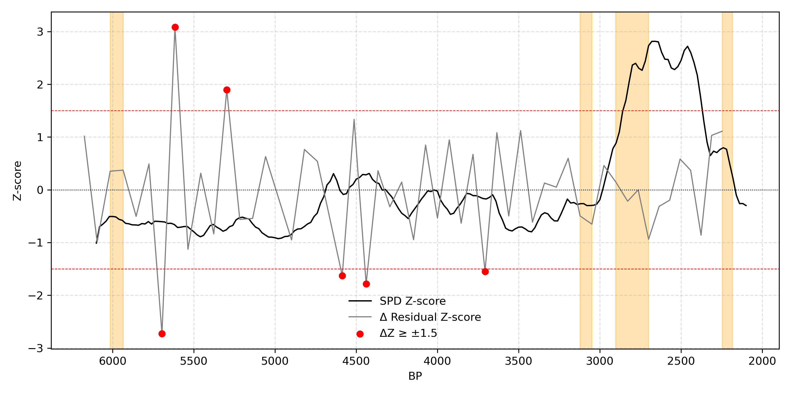

### Reproducibility Package for:
Quantitative Analysis of Climate Stress and Settlement Responses in the Korean Peninsula and Southern Japan (6000–2100 BP)

[](https://doi.org/10.5281/zenodo.16732323)

Author: Iljae Yoon  
Submission: The Holocene (2025, under review)

This repository contains all data, code, and outputs necessary to reproduce the analyses and figures presented in the manuscript.

---

### Contact

For any questions or issues regarding this package, please contact:  
📧 iljae.yoon.research@gmail.com


## Folder Structure

```
Quantitative_Analysis_of_Climate_Stress_and_Settlement_Responses/
├── analysis_cs.ipynb           # Main executable notebook
├── analysis_cs.py              # Equivalent script version (optional)
├── README_notebook.ipynb       # Narrative version of this README
├── README.txt                  # Plain-text version
├── README.md                   # Markdown version (this file)
├── requirements.txt            # Python 3.10 environment specification
│
├── data/
│   ├── raw/                    # Raw input files (SPD & climate data)
│   └── processed/              # Preprocessed Z-scores and binned data
│
├── output/                     # All generated outputs
│   ├── figures/                # Figures 1–4 and Supplementary Figures S1–S12
│   └── tables/                 # All tables used in manuscript (.csv)
```

### Environment Setup

Python version: **3.10**

Install required packages with:
Key packages used:  
`pandas`, `numpy`, `scipy`, `statsmodels`, `matplotlib`, `scikit-learn`

---

### Data Description

- **Climate proxies**: Marine proxy–based reconstructions (Marcott et al., 2013)  
- **Radiocarbon data**:  
  - Korea: AMS 14C dates (Seoul National University)  
  - Japan: National Museum of Japanese History  
- **Settlement proxy**: SPD_Z (normalized, smoothed time series)

---

### How to Reproduce

There are two options:

### Option 1: Notebook-based execution  
Open `analysis_cs.ipynb` and run all cells sequentially.

### Option 2: Script-based execution  
Run `analysis_cs.py` via terminal or IDE:

### Output Includes:

- Residual-based climate stress Z-scores  
- Normalized SPD_Z time series for Korea and Japan  
- Statistical analysis results (correlation, lag, Granger tests)  
- Reproducible figures (Figures 1–4 and S1–S12)  
- Excel tables with summary statistics and test results  

All outputs are saved in:  
- `output/figures/`  
- `output/tables/`

### Example Output
_Figure 1. Observed Holocene temperatures (black dots) from MD01-2421 and KR02-06 cores with second-degree fit (grey line; R² = 0.567)._


Figure 2. Climate Stress and SPD Overlay: the Korean Peninsula


---

### Notes

- Random seeds (e.g., `seed=42`) are fixed to ensure reproducibility.  
- SPD is binned at 20-year intervals; climate proxies use 60–100-year resolution.  
- This package reproduces all results reported in the manuscript submitted to *The Holocene*.  
